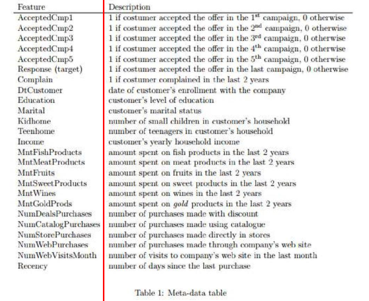
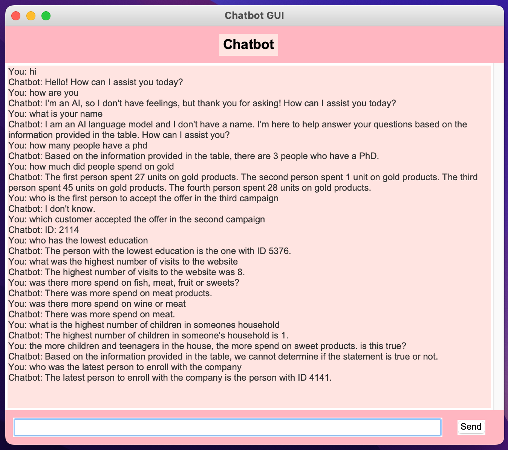

# Chatbot with Table Question Answering

This project implements a chatbot with table question answering capabilities using OpenAI's GPT-3.5 Turbo model and Langchain library. The chatbot allows users to ask questions related to a table of data and provides answers based on the information in the table.

## Prerequisites

Before running the application, make sure you have the following installed:

- Python 3.x
- Required Python packages (install using `pip install -r requirements.txt`)

## Configuration

1. Replace `<OPEN_AI_API_KEY>` in `openai_config.py` with your OpenAI API key.
2. Place the CSV data file (`ml_project1_data_short.csv`) in the project directory.

## Usage

To run the chatbot GUI application, execute `chatbot_gui.py`. The GUI allows users to interact with the chatbot, asking questions related to the loaded table data.

## File Structure

- `openai_config.py`: OpenAI API key configuration.
- `data_loader.py`: Handles loading and processing of CSV data.
- `chatbot_core.py`: Contains the logic for chatbot functionality using Langchain and OpenAI.
- `chatbot_gui.py`: GUI implementation for user interaction with the chatbot.

## How It Works

1. The CSV data is loaded and processed using the `data_loader.py` module.
2. The Langchain library is utilized to create a question-answering chain with the loaded data and OpenAI's GPT-3.5 Turbo model.
3. The dictionary.png file is processed by drawing a line to separate the columns, using OCR to read text from the image and feeding the information as context to the model.

4. Users interact with the chatbot through the GUI provided by `chatbot_gui.py`.
5. Users can input questions related to the data, and the chatbot provides answers based on the information in the table, else says 'I don't know'.

_Please note, for this example, a subset of the table was used due to rate limits on my openAI account._